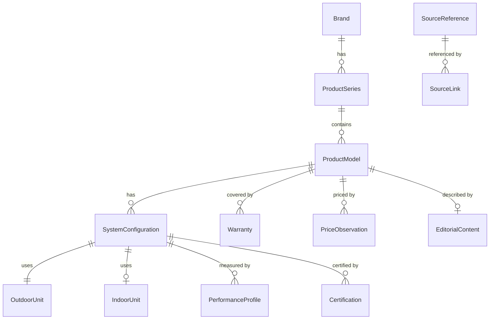

# Architecture des données — ThermopompesÀVendre.ca

> Source de vérité unique pour toutes les données de thermopompes.

---

## Vue d'ensemble



---

## Entités

| Entité | Description | Fichier |
|---|---|---|
| **Brand** | Fabricant ou marque commerciale | `types/brand.ts` |
| **ProductSeries** | Famille commerciale (ex: "Daikin FIT") | `types/product.ts` |
| **ProductModel** | Modèle présenté au consommateur | `types/product.ts` |
| **OutdoorUnit** | Unité extérieure physique | `types/product.ts` |
| **IndoorUnit** | Unité intérieure physique | `types/product.ts` |
| **SystemConfiguration** | Combinaison exacte intérieur + extérieur | `types/product.ts` |
| **PerformanceProfile** | Données de performance par température | `types/performance.ts` |
| **Certification** | ENERGY STAR, AHRI, climat froid | `types/certification.ts` |
| **Warranty** | Garantie (pièces, compresseur, main-d'œuvre) | `types/warranty.ts` |
| **PriceObservation** | Observation de prix temporelle | `types/price.ts` |
| **SourceReference** | Provenance d'une donnée | `types/source.ts` |
| **EditorialContent** | Contenu rédactionnel (séparé des specs) | `types/editorial.ts` |
| **IncentiveProgram** | Programme de subvention | `types/subsidy.ts` |
| **EligibilityRule** | Règle d'admissibilité | `types/subsidy.ts` |
| **ThermoScoreResult** | Score calculé (jamais manuel) | `types/thermoscore.ts` |

---

## Conventions d'unités internes

| Mesure | Unité interne | Affichage Québec |
|---|---|---|
| Température | °C (number) | °C |
| Capacité | BTU/h (number) | BTU/h |
| Bruit | dB(A) (number) | dB(A) |
| Dimensions | mm (number) | pouces (converti) |
| Poids | kg (number) | lb (converti) |
| Prix | centimes CAD (integer) | $ CAD (formaté) |
| Tension | volts (number) | V |
| Courant | ampères (number) | A |
| Puissance | watts (number) | W |

**Règle fondamentale** : `null` = donnée inconnue. Jamais `0` pour "pas disponible".

---

## Statuts de publication

| Statut | Signification |
|---|---|
| `draft` | En cours de saisie |
| `needs_review` | Données à vérifier |
| `verified` | Données vérifiées, pas encore publiques |
| `published` | Visible publiquement |
| `discontinued` | Produit retiré du marché (reste accessible) |
| `archived` | Retiré de toute consultation |

---

## Niveaux de confiance (`DataConfidence`)

| Niveau | Signification |
|---|---|
| `verified` | Confirmé par source indépendante |
| `manufacturer_claim` | Info du fabricant non vérifiée |
| `estimated` | Valeur estimée ou calculée |
| `placeholder` | Donnée fictive de développement |
| `needs_review` | À revérifier |
| `deprecated` | Donnée obsolète |

---

## Stratégie de provenance

Chaque donnée importante peut être reliée à une `SourceReference` via un `SourceLink`.

```typescript
// Sur une entité
sources?: SourceLink[];

// SourceLink pointe vers un SourceReference
{ sourceId: "src-ahri-2024", fields: ["seer2", "hspf2"], confidence: "verified" }
```

---

## Structure des fichiers

```
src/lib/data/
├── types/           # Types TypeScript purs
│   ├── enums.ts     # Toutes les valeurs de référence
│   ├── brand.ts
│   ├── product.ts   # Series, Model, Config, Units
│   ├── performance.ts
│   ├── certification.ts
│   ├── warranty.ts
│   ├── price.ts
│   ├── source.ts
│   ├── editorial.ts
│   ├── subsidy.ts
│   ├── thermoscore.ts
│   └── index.ts     # Barrel export + BrandDataset
├── schemas/
│   └── index.ts     # Schémas Zod (validation)
├── fixtures/
│   └── brands/      # Un fichier par marque
│       ├── dev-brand-alpha.ts
│       └── dev-brand-beta.ts
├── queries/
│   ├── brands.ts
│   ├── products.ts
│   ├── thermomatch.ts
│   └── index.ts
├── registry.ts      # Charge, valide, indexe
├── dev-fixtures.ts  # Ancien (homepage) — à migrer
└── index.ts         # API publique
```

---

## Comment ajouter une marque

1. Créer `src/lib/data/fixtures/brands/brand-nom.ts`
2. Exporter un objet `BrandDataset` avec toutes les entités
3. Ajouter l'import dans `registry.ts` → `RAW_DATASETS`
4. Lancer `npx vitest run` pour valider
5. Le registre détectera automatiquement les erreurs

### Exemple minimal

```typescript
import type { BrandDataset } from "../../types";

export const brandExempleDataset: BrandDataset = {
  brand: {
    id: "brand-exemple",
    slug: "exemple",
    name: "Exemple",
    activeInQuebec: true,
    status: "draft",
    createdAt: "2026-01-01",
    updatedAt: "2026-01-01",
  },
  series: [],
  models: [],
  outdoorUnits: [],
  indoorUnits: [],
  configurations: [],
  performanceProfiles: [],
  certifications: [],
  warranties: [],
  priceObservations: [],
  sources: [],
  editorial: [],
};
```

---

## Comment ajouter un modèle

1. Ouvrir le fichier de la marque
2. Ajouter une entrée dans `series` (si nouvelle série)
3. Ajouter dans `models` avec tous les champs requis
4. Ajouter `outdoorUnits` et `indoorUnits`
5. Ajouter une `SystemConfiguration` reliant le tout
6. Ajouter un `PerformanceProfile` avec les points de données
7. Utiliser `null` pour toute valeur inconnue
8. Spécifier le `confidence` de chaque source

---

## Comment distinguer données vérifiées et estimées

- Chaque `SourceLink` a un champ `confidence`
- Chaque `PerformanceDataPoint` a un champ `confidence`
- Les prix ont un `PriceType` et un `DataConfidence`
- Les certifications ont un `CertificationStatus`
- Le `ThermoScoreResult` a un `confidence` et liste les `missingData`

**Règle** : si `confidence === "placeholder"` → données fictives de développement.

---

## Validation

La validation se fait en 3 couches :

1. **Zod** — structure et types (`schemas/index.ts`)
2. **Registry** — intégrité référentielle (IDs, slugs, foreign keys)
3. **Business rules** — min < max, pas de 0 pour inconnu, etc.

### Erreurs détectées automatiquement

- Slugs en double
- IDs en double
- Valeurs impossibles (capacité = 0)
- Plage min > max
- Certification sans configuration associée
- Source manquante référencée par un SourceLink
- Modèle discontinué avant lancement

---

## Migration future vers DB/CMS

Seul `registry.ts` devra changer :
- Remplacer les imports de fixtures par des requêtes DB
- Les types, schemas, queries et l'API publique restent identiques
- Les composants n'importent que depuis `@/lib/data`
